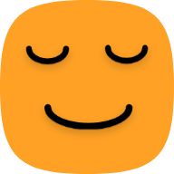

<!-- PROJECT LOGO -->
 

  

<h3 align="center">Daily Reflection</h3>

  

    Reflect on your goals
     
    <a href=""><s>💻View Demo</s></a> |
    <a href="https://github.com/Mozzo1000/daily-reflection/issues">🐞Report Bug</a> |
    <a href="https://github.com/Mozzo1000/daily-reflection/issues">✨Request Feature</a> |
  

# Scope
- Record your personal goals like brushing your teeth two times a day and read for 60 minutes every day.
- Reflect on your day and input how well you did to meet your goals.
- Every reflection starts with a mood check, how did you feel today?
- Local storage on device with possibility to export